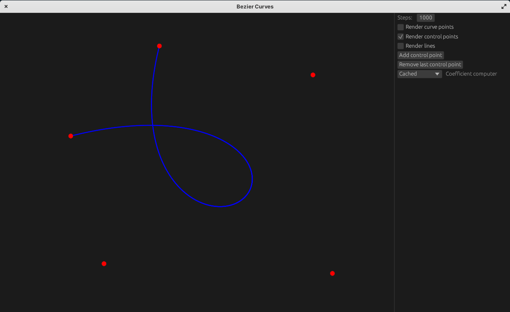

# Bezier Curves
Learning Bezier curves and illustrating in Rust.



# What is Bezier curve?

It's a curve that was invented in 1960s by french engineer Pierre Bézier to design extraordinary shapes. \
It's not easy to represent Bézier curve as a set of simple mathematical functions.
This curve is parameterized with some parameter and set of points in space and it can turn into any smooth shape you want.

# How does this work?

Let's define some concepts:
+ $t$ — is a curve parameter, assume that $t \in \left[ 0;1 \right]$
+ $P_i$ — is a i-th point that defines shape of curve, i.e. control point
+ $B_n\left( t \right)$ — is a point on Bézier curve that uses n + 1 control points

Bézier curve properties that we need for definition:
+ Curve begins at first control point and ends at last control point
+ The start and end of the curve is tangent to lines between first two and last two segments
+ Curve can be split at any point into two subcurves which is also a Bézier curve

Simple case of bezier curve is just a point:

$$
B_0\left( t \right) = P_0
$$

A bit more complicated case is a two-point curve, which is just linear interpolation of these control points:

$$
B_1\left( t \right) = \left( 1 - t \right)P_0 + t P_1
$$

Let's assume that we have n + 1 points so using third property $B_n\left( t \right)$ can be defined recursevily:

$$
B_0\left( t \right) = P_0 \\
B_n\left( t \right) = \left( 1 - t \right) B_{n-1}\left( t \right) + t B_{n-1}\left( t \right)
$$

However all coefficient before control points can br calculated and curve can be expressed also as:

$$
B_n\left( t \right) = \sum\limits_{i=0}^n {n \choose i} \left( 1 - t \right)^{n - i} t^i P_i
$$

In general case to compute point on a curve with given parameter $t$ we use matrix form:

$$
B_n\left( t \right) =
\left( {\begin{array}{cccc}
P_{0x} & P_{1x} & \dots & P_{nx} \\
P_{0y} & P_{1_y} & \dots & P_{ny} \\
\end{array} } \right)
\left( {\begin{array}{cccc}
b_{0,n,n} & \cdots & \dots & b_{0,n,0} \\
\dots & \dots & \dots & \dots \\
\dots & \dots & \dots & \dots \\
b_{n,n,n} & \dots & \dots & b_{n,n,0} \\
\end{array} } \right)
\left( {\begin{array}{c}
t^n \\
t^{n-1} \\
\dots \\
1 \\
\end{array} } \right)
$$

# Build/Run

To build and run the application you need to install Rust and type following:
```bash
git clone https://github.com/ivan0sokin/bezier-curves.git
cd bezier-curves
cargo run --release
```
